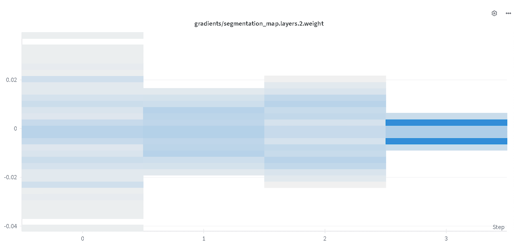
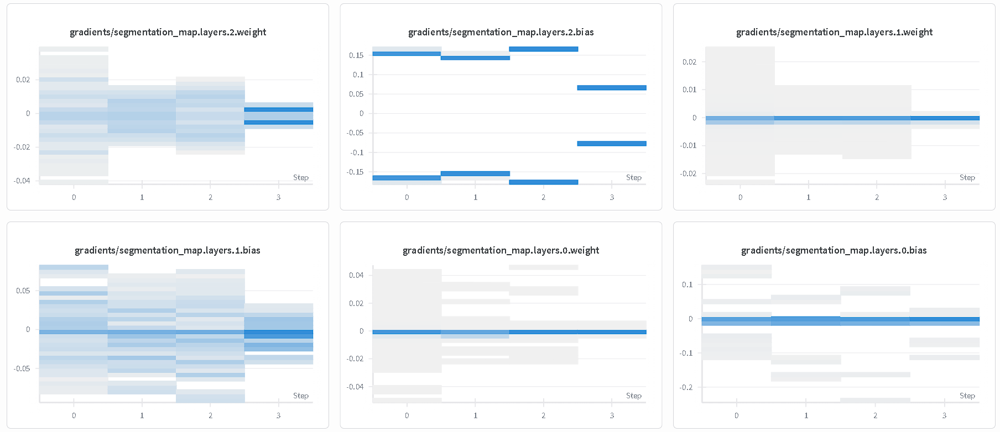
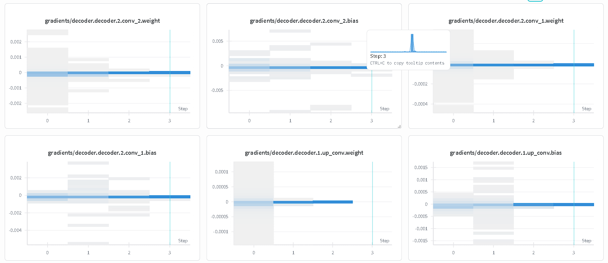
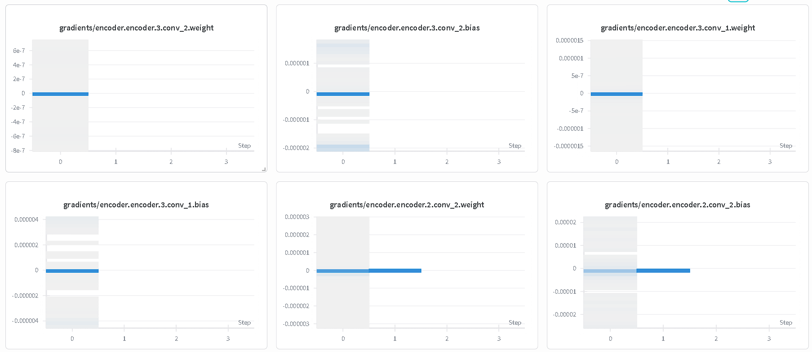

# U-Net Experimental Research Branch

> Branch: `unet_tanh_batchnorm_exp01`

---

## Overview

This branch contains the first controlled architectural experiment performed on the baseline U-Net implementation.

The primary objective of this experiment is not to maximize segmentation performance, but to study how architectural and optimization choices influence:

* Gradient propagation
* Feature preservation
* Optimization stability
* Information flow through skip connections
* Training dynamics of encoder-decoder architectures

This branch serves as a research log documenting both successful and unsuccessful modifications to the original U-Net architecture.

---

## Why U-Net?

U-Net is not a generative model. It was originally introduced for biomedical image segmentation, where the objective is to assign a class label to every pixel in an image.

Despite this, U-Net forms the architectural foundation of many modern generative AI systems.

Understanding U-Net is important because its encoder-decoder structure, skip connections, and multi-scale feature aggregation mechanisms directly influenced:

* Denoising Diffusion Probabilistic Models (DDPMs)
* Stable Diffusion
* Latent Diffusion Models
* Diffusion Transformers with U-Net-inspired components
* Image restoration and denoising systems

The long-term goal of this repository is to build a strong architectural understanding that can later be transferred to modern diffusion-based generative models.

---

# Research Methodology

Each experimental branch follows the same workflow:

1. Start from a verified baseline implementation.
2. Modify a single architectural or optimization component.
3. Measure training behavior.
4. Analyze gradient propagation.
5. Study failure modes.
6. Document observations.
7. Use findings to design the next experiment.

The goal is to understand *why* a modification succeeds or fails rather than simply reporting performance metrics.

---

# Experiment 01

## Objective

Investigate the effect of replacing ReLU-based activations and initialization schemes with a Tanh-based configuration while introducing additional regularization.

---

## Architectural Changes

### 1. Activation Function

Replaced:

```python
nn.ReLU()
```

with

```python
nn.Tanh()
```

---

### 2. Normalization

Added Batch Normalization after convolutional layers.

---

### 3. Regularization

Applied L2 regularization:

```python
weight_decay = 1e-4
```

---

### 4. Weight Initialization

Replaced Kaiming Initialization with Xavier Normal Initialization.

Motivation:

* Kaiming Initialization is designed for ReLU-like activations.
* Xavier Initialization is more suitable for bounded symmetric activations such as Tanh.

---

# Experimental Results

## Observation 01

### Batch Normalization Alters Encoder Feature Distributions

Introducing Batch Normalization significantly changed the feature distributions produced by the encoder.

Since U-Net heavily relies on skip connections to transfer spatial information directly from encoder to decoder, these altered feature distributions negatively impacted reconstruction quality.

Observed effects:

* Reduced feature fidelity.
* Weaker skip-connection information transfer.
* Degraded decoder reconstruction quality.
* Less stable optimization behavior.

Batch Normalization was therefore removed in subsequent trials.

---

## Observation 02

### Tanh + Xavier + L2 Leads to Severe Gradient Attenuation

After removing Batch Normalization and retaining:

* Tanh
* Xavier Initialization
* L2 Regularization

the model exhibited severe vanishing-gradient behavior.

Observed characteristics:

* Rapid gradient collapse.
* Extremely small parameter updates.
* Near-stagnant optimization.
* Encoder learning almost completely suppressed.

This behavior is consistent with the saturation properties of the Tanh activation function.

As activations approach ±1:

```text
tanh'(x) → 0
```

which causes gradients to diminish during backpropagation.

---

# Gradient Flow Analysis

The following visualizations were collected to investigate gradient propagation through different regions of the network.

---

## Segmentation Head

<table>
<tr>

<td align="center">


Segmentation Head Layer 2 Gradients

</td>

<td align="center">


Segmentation Head Gradient Evolution

</td>

</tr>
</table>

### Analysis

The segmentation head continues to receive usable gradient signals because it is directly connected to the loss function.

Although gradients decrease over time:

* Parameters still update.
* Learning remains active.
* Optimization remains possible.

However, gradient magnitudes are noticeably smaller than the baseline model.

---

## Decoder

<table>
<tr>

<td align="center">


Decoder Gradient Distribution

</td>

</tr>
</table>

### Analysis

The decoder receives substantially weaker gradients than the segmentation head.

Observed behavior:

* Most gradients collapse toward zero.
* Parameter updates become extremely small.
* Learning slows dramatically.

Only a fraction of the original learning signal survives propagation through the network.

---

## Encoder

<table>
<tr>

<td align="center">


Encoder Gradient Distribution

</td>

</tr>
</table>

### Analysis

The encoder exhibits the strongest evidence of gradient collapse.

Gradient magnitudes fall into approximately:

```text
10⁻⁵ → 10⁻¹⁰
```

which are effectively zero for practical optimization.

Unlike the segmentation head, the encoder sits furthest from the loss function.

To reach these layers, gradients must travel through:

```text
Loss
 ↓
Segmentation Head
 ↓
Decoder
 ↓
Bottleneck
 ↓
Encoder
```

Under the Tanh-based configuration, the learning signal becomes progressively attenuated at every stage.

As a result:

* Encoder weights receive negligible updates.
* Feature extraction layers stop learning.
* Optimization becomes dominated by the final layers of the network.

---

# Gradient Hierarchy

The experiment reveals a clear gradient hierarchy:

```text
Segmentation Head
        ↓
      Decoder
        ↓
      Encoder
```

or equivalently:

```text
Gradient Magnitude

Segmentation Head
        >
Decoder
        >
Encoder
```

This indicates that later layers continue learning while earlier layers become effectively frozen.

---

# Conclusions

## Successful Findings

* Xavier Initialization is compatible with Tanh activations.
* No exploding-gradient behavior was observed.
* The network remains numerically stable.

## Failure Modes Identified

### Batch Normalization

* Alters encoder feature distributions.
* Weakens skip-connection information quality.
* Reduces reconstruction effectiveness.

### Tanh Saturation

* Causes severe gradient attenuation.
* Produces near-zero gradients in deep layers.
* Leads to optimization stagnation.

### Combined Effect

The combination of:

* Tanh
* Xavier Initialization
* L2 Regularization

does not provide healthy gradient propagation for the current U-Net configuration.

The primary bottleneck observed in this experiment is:

```text
Gradient Starvation
```

where the learning signal becomes progressively weaker before reaching earlier layers.

---

# Future Experiments

The following investigations will be performed in separate branches.

| Branch                            | Objective                                                       |
| --------------------------------- | --------------------------------------------------------------- |
| `unet_dropout_exp02`              | Study the impact of Dropout on generalization and gradient flow |
| `unet_attention_bottleneck_exp03` | Introduce attention mechanisms in the bottleneck layer          |
| `unet_residual_exp04`             | Add ResNet-style residual connections to improve optimization   |

---

## Experiment 02 — Dropout

Research Question:

> Can moderate dropout improve generalization without disrupting feature propagation?

---

## Experiment 03 — Attention Bottleneck

Research Question:

> Can attention mechanisms improve global context aggregation before decoding?

Candidate Architectures:

* Self-Attention
* Attention Gates
* Transformer Bottleneck

---

## Experiment 04 — Residual U-Net

Research Question:

> Can residual connections mitigate vanishing gradients and improve optimization stability?

Expected Benefits:

* Improved gradient propagation
* Better information preservation
* Easier optimization of deeper architectures
* Reduced gradient starvation

---

## Repository Philosophy

This repository is not intended to showcase only successful models.

Failed experiments are preserved and documented because understanding failure modes is often more valuable than reporting successful results alone.

Each branch serves as a reproducible research artifact containing:

* Source code
* Training configuration
* Gradient analysis
* Experimental observations
* Architectural conclusions

The objective is to build a deep understanding of neural network behavior by systematically investigating architectural design choices from first principles.
