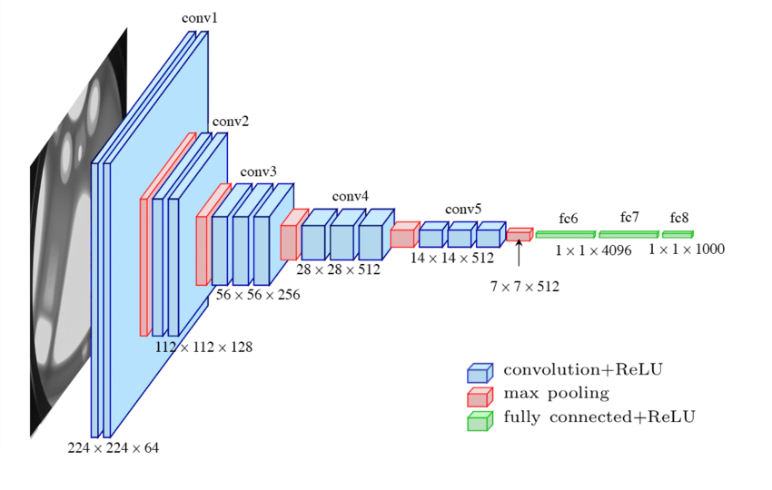
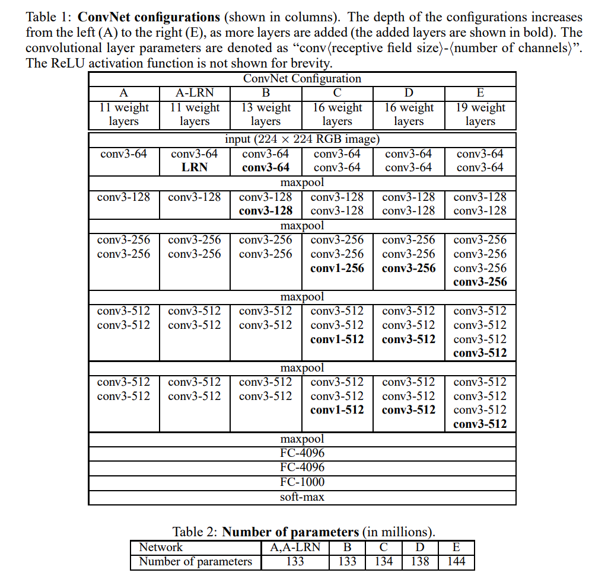

# VGG-19 From Scratch

This notebook documents my journey of implementing and training the VGG-19 architecture from scratch in PyTorch.

The main motivation behind this project is not achieving the best classification accuracy or reproducing the strongest pretrained model. Instead, I want to deeply understand the architecture that powers many classical computer vision and style transfer systems.

My long-term goal is to implement the paper **"A Neural Algorithm of Artistic Style"** from scratch. The original paper uses a pretrained VGG-19 network, and while I could directly use the official model, I want to understand every component involved in the pipeline.

To support experimentation, I plan to build the Neural Style Transfer engine in a modular way so that the feature extractor can be swapped easily between:

- Original pretrained VGG-19
- My custom VGG-19 implementation
- Future VGG variants or custom backbones

This repository serves as both a learning journal and a foundation for future style transfer research and implementations.

---

# What is VGG-19?

VGG-19 is a deep Convolutional Neural Network introduced by the Visual Geometry Group (VGG) at the University of Oxford.

The network contains:

- 16 Convolutional Layers
- 3 Fully Connected Layers
- ReLU activations after each convolution
- Max Pooling for spatial downsampling

VGG-19 became one of the most influential architectures in computer vision and remains widely used as a feature extractor for transfer learning and neural style transfer.

---

# Why VGG-19?

The central idea behind VGG-19 was simple:

> Increase network depth using small 3×3 convolution filters.

Instead of using large kernels, multiple small convolutions are stacked together, allowing the network to learn richer hierarchical features while maintaining a manageable number of parameters.

This design later became a key reason why VGG-19 worked so well as a perceptual feature extractor for style transfer.

---

# Architecture Configuration

### Convolution Layers

- Kernel Size = 3 × 3
- Padding = 1
- Stride = 1
- Activation = ReLU

### Max Pooling Layers

- Kernel Size = 2 × 2
- Stride = 2

### Fully Connected Layers

- FC-4096
- FC-4096
- FC-1000

---

## Architecture Diagram

---

## Original VGG Paper Configuration

The original paper introduced multiple configurations (A–E). Configuration **E** corresponds to **VGG-19**.

---

## Notes

### Advantages

- Simple and highly modular architecture
- Strong hierarchical feature extraction
- Excellent backbone for transfer learning
- Widely used in Neural Style Transfer

### Limitations

- Roughly 144 million parameters
- Computationally expensive
- High memory consumption
- Slower than many modern architectures

---

# Paper

**Very Deep Convolutional Networks for Large-Scale Image Recognition**

Paper:
https://arxiv.org/pdf/1409.1556

---

# Next Goal

After successfully training and understanding VGG-19, the next step is to implement:

**A Neural Algorithm of Artistic Style**

The objective is to build a clean, modular Neural Style Transfer engine where the feature extractor can be swapped without changing the optimization pipeline.